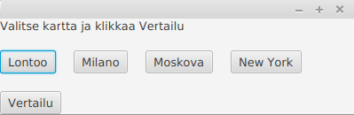

# Käyttöohje

Lataa tiedosto [Reitinhaku-1.0-SNAPSHOT.jar](https://github.com/sinisaarinen/tira-labra/releases/tag/loppupalautus) ja sovelluksen käyttämät kartat. Sovellus odottaa, että suoritushakemistossa on kansio _Kartat_, joka sisältää tiedostot _London_2_256.map_, _Milan_2_256.map_, _Moscow_1_256.map_ ja _NewYork_1_256.map_.

## Käynnistys

Sovellus käynnistetään komennolla
```
java -jar Reitinhaku-1.0-SNAPSHOT.jar
```
## Menunäkymä



Ensimmäisessä näkymässä pääsee valitsemaan kartan. Jos valintaa ei tee, sovellus valitsee automaattisesti Lontoon kartan. Klikkaa haluamaasi karttaa ja paina `Vertailu`.

## Vertailunäkymä


Vertailunäkymässä syötä haluamasi alku- ja loppupisteen x- ja y-koordinaatit kokonaislukuina. Jos syöte on virheellinen (kartan ulkopuolella, esteen päällä, ei kokonaislukumuodossa), ohjelma ilmoittaa siitä.

Kun painaa `Hae reitti`, laskee ohjelma lyhimmät reitin Dijkstran ja A*-algoritmeilla ja piirtää ne kartalle. Ohjelma ilmoittaa lyhimmän reitin, käsitellyt solmut ja kuluneen ajan kullekin algoritmille. Reitit voi pyyhkiä painamalla `Pyyhi reitit`.

Menuvalikkoon voi palata painamalla `Menu`.
